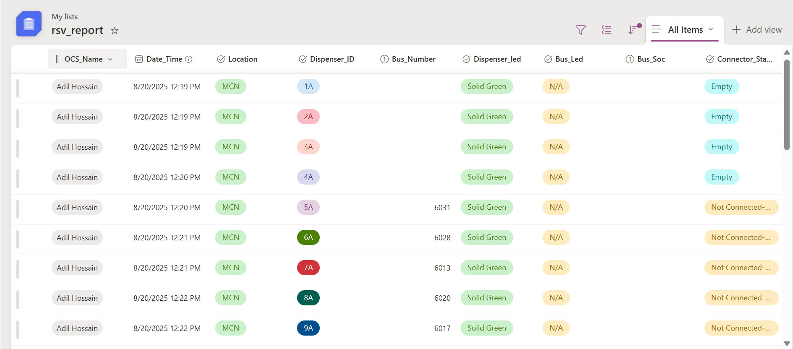
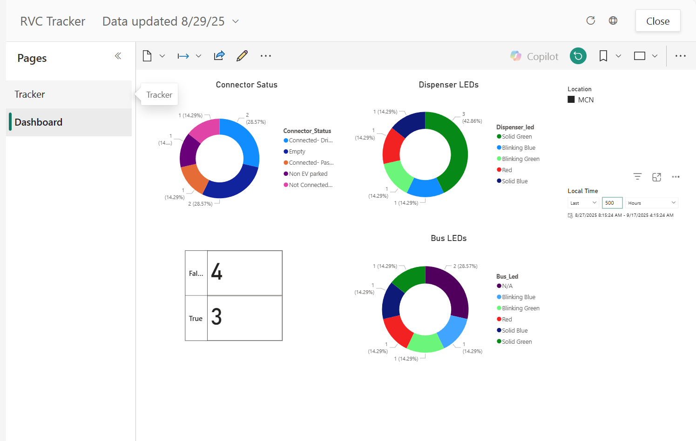
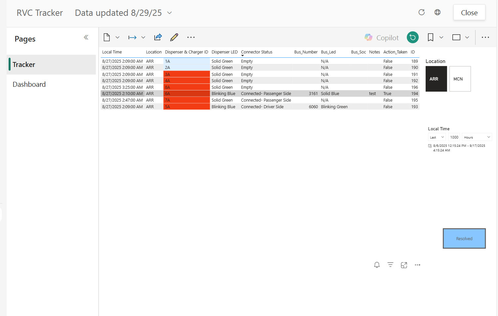
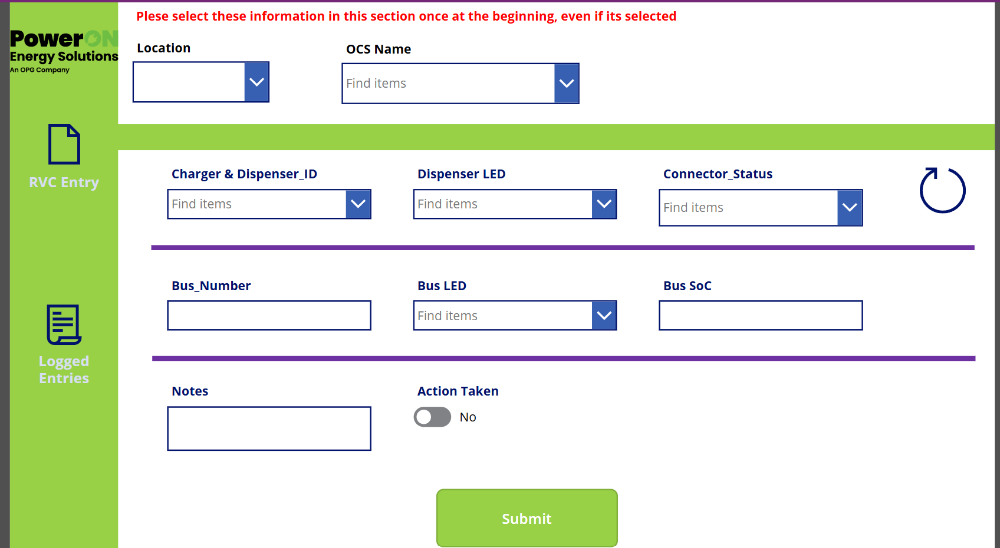
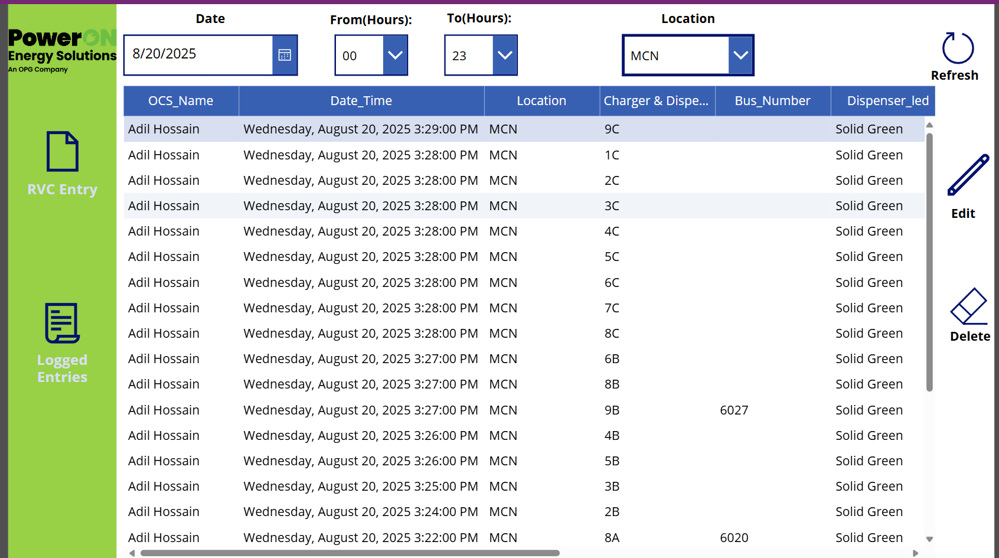
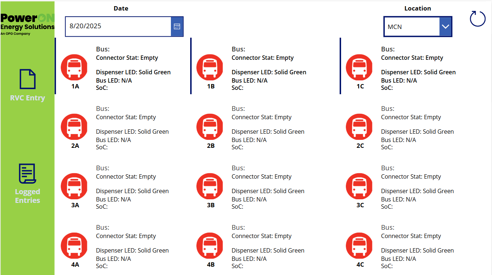

# RVC Monitoring System

A Power Platform-based solution for monitoring and reporting charger and bus statuses.

This system integrates:

- **SharePoint** as the backend database
- **Power Apps** for data entry and operational UI
- **Power BI** for real-time dashboards and analytics

---

## 📌 System Architecture

**Workflow:**

1. Users enter charger/bus status using **Power Apps**
2. Data is stored in **SharePoint list (`rsv_report`)**
3. **Power BI** pulls and visualizes the data live


---

## 📁 SharePoint Database

**Purpose:** Central repository for all charger and bus status records.

**Key Columns:**
- `OCS_Name` – Operator name  
- `Date_Time` – Timestamp of data entry  
- `Location` – Site name (e.g., MCN, ARR)  
- `Dispenser_ID` – Charger identifier  
- `Bus_Number`, `Bus_Soc`, `Bus_Led` – Bus-related info  
- `Dispenser_led`, `Connector_Status` – Charger-related status  

**View:**

  


---

## 📊 Power BI Integration

**Purpose:** Real-time monitoring and reporting of operational data.

### 🖥️ Tracker Dashboard

- Shows the live status of all dispensers and connected buses
- Includes LED state, SOC, and connection status

  


### 📋 Data Table View

- Tabular data representation
- Useful for filtering, searching, and exporting raw data

  


---

## 💻 Power Apps Frontend

**Purpose:** User interface for field operators to enter and review data.

### 📝 Data Entry Screen

- Simple form to input charger status, bus details, and location
- Submits data directly to SharePoint

  


### 📑 Data Table View

- Displays all submitted records
- Supports filtering by date, time (From/To hours), and location

  


### 📈 Custom Graphical Visualization

- Visual layout showing charger and bus connections
- Provides a more intuitive operational overview

  


---

## 🔁 Data Flow Summary

```mermaid
graph LR
A[Power Apps] --> B[SharePoint List]
B --> C[Power BI Dashboard]
